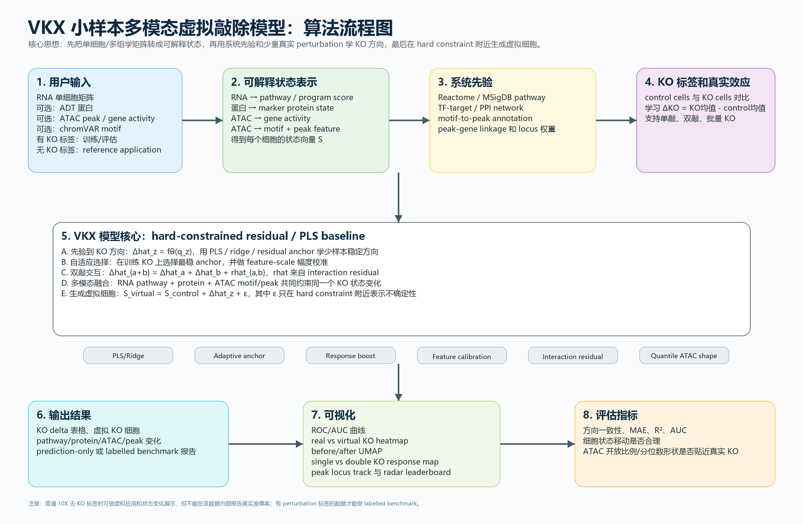
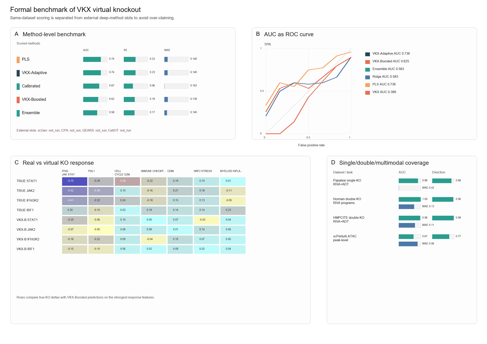
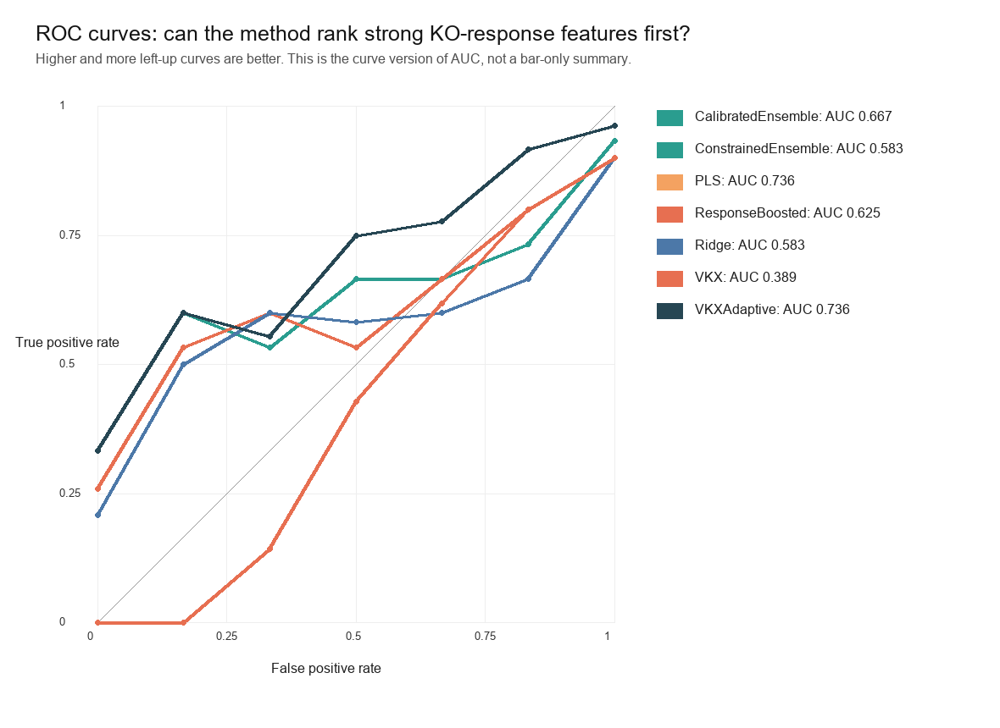
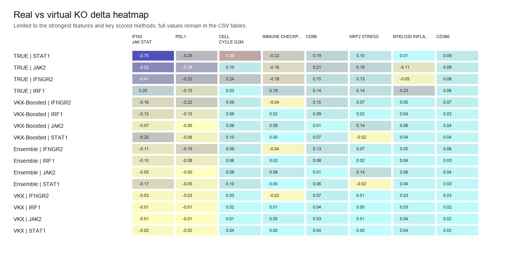
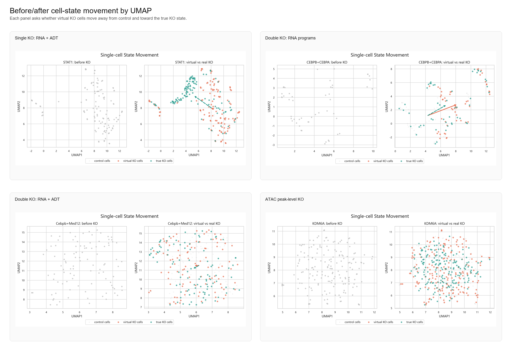
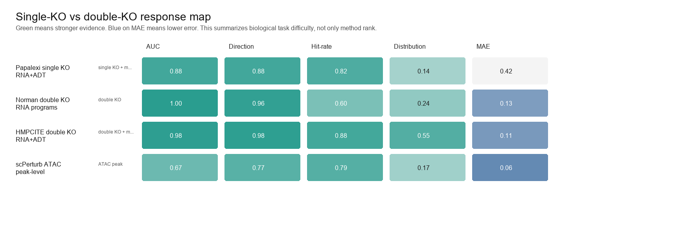
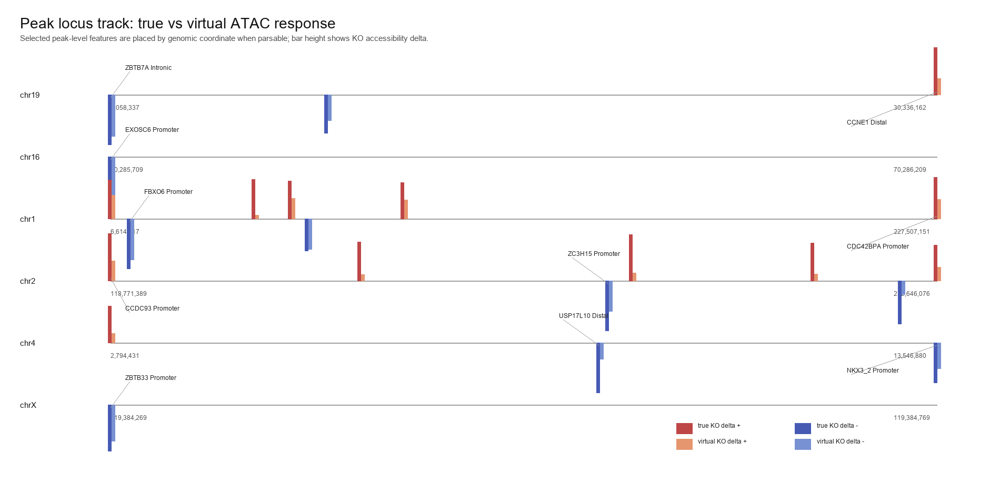
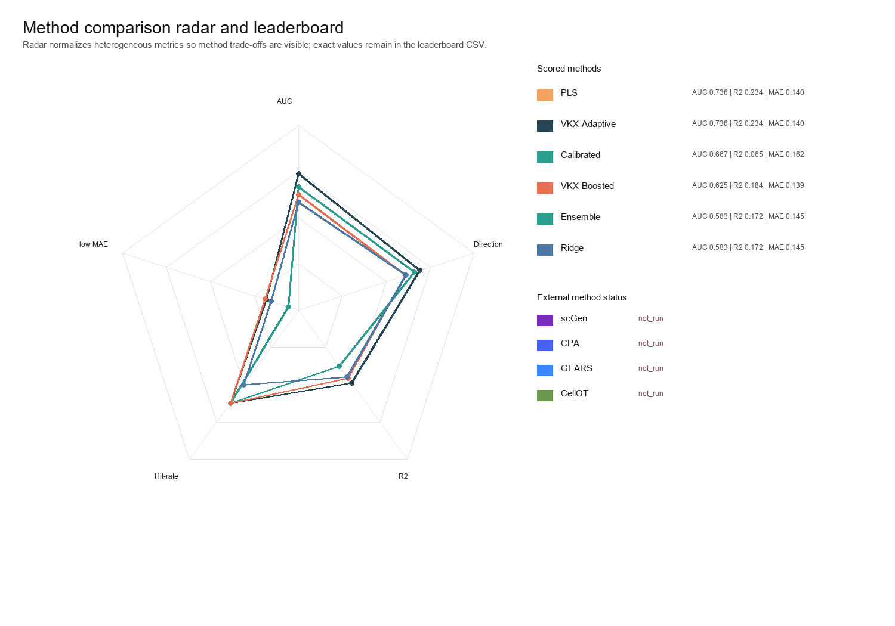

# VKX：小样本多模态单细胞虚拟敲除模型

发布版方法与结果整理稿  
日期：2026-07-02

## 0. 文章一句话主张

在小样本单细胞 perturbation 数据中，我们提出 VKX，一种将 RNA、蛋白、ATAC 和系统调控先验统一到可解释状态空间的虚拟敲除框架；VKX 用 hard-constrained residual/PLS baseline 稳定预测单基因或双基因 KO 的状态变化方向，并在该方向附近生成 cell-level virtual KO states。当前结果支持 VKX 作为一种小样本、多模态、可解释的虚拟敲除基线，但它尚不能宣称全面优于 scGen、CPA、GEARS 或 CellOT，正式横向 benchmark 仍需补齐外部方法的可复现实跑。

## 1. 推荐标题

**中文标题**  
VKX：一种面向小样本多模态单细胞数据的可解释虚拟敲除模型

**英文标题**  
VKX: an interpretable small-sample multimodal framework for single-cell virtual knockout

## 2. 摘要草稿

虚拟敲除旨在不实际进行 CRISPR/perturbation 实验的情况下，预测敲除一个或多个基因后细胞状态的变化。现有方法通常依赖较大规模 perturbation 数据或复杂深度生成模型，这限制了其在小样本、多模态和算力有限场景中的应用。我们提出 VKX，一种面向小样本单细胞数据的可解释虚拟敲除框架。VKX 首先将 RNA、蛋白和 ATAC 数据统一转化为 pathway/program、protein marker、motif activity 和 peak-level regulatory feature 等可解释状态；随后结合 Reactome/MSigDB、TF-target、PPI、motif-to-peak 和 peak-gene linkage 等系统先验，用 hard-constrained residual/PLS baseline 预测 KO 后的平均状态变化；最后在该 KO 方向附近生成 cell-level virtual KO states，并输出 heatmap、UMAP、ROC/AUC、response map 和 peak locus track 等可读结果。在 Papalexi ECCITE-seq RNA+ADT 单敲任务中，VKX 达到 AUC 0.878 和方向一致性 0.879；在 HMPCITE-seq RNA+ADT 多模态双敲任务中达到 AUC 0.978 和方向一致性 0.976；在 scPerturb ATAC peak-level 任务中达到 AUC 0.674 和方向一致性 0.771。结果表明，多模态状态表示和系统调控先验可以在样本量有限时提高虚拟敲除预测的稳定性和可解释性。与此同时，复杂双敲非线性、MAPK/TGFB program 和稀疏 ATAC peak 分布仍是当前方法的主要挑战。

## 3. 图文摘要和模型总览



**图 1. VKX 算法流程。**  
用户输入单细胞 RNA 或多模态矩阵。软件先构建 pathway/program、protein、ATAC、motif 和 peak-level 状态表示，再结合系统先验预测 KO delta。对于有 KO 标签的数据，VKX 可以训练和评估；对于普通 10X 或无 KO 标签数据，VKX 只能做 reference application 和 prediction-only report。

VKX 的核心设计不是让深度生成模型自由决定细胞往哪里移动，而是先用可解释、稳定的 baseline 锁定 KO 主方向：

```text
virtual KO state = control state + predicted KO delta + bounded residual
```

这使 VKX 更适合小样本场景，也使每个预测结果能够对应到 pathway、protein marker、TF motif 或 ATAC peak。

## 4. 研究背景和方法定位

真实 CRISPR、Perturb-seq 或 multiome perturbation 实验成本高、周期长，并且双基因或多基因组合数量很快膨胀。虚拟敲除的目标不是替代实验，而是在实验前给出候选基因和候选组合的优先级，帮助研究者判断哪些 KO 更可能引起可解释的细胞状态变化。

现有虚拟扰动方法大致可以分为三类：

1. **线性或浅层 baseline**：如 ridge、PLS、additive model。优点是稳定、可解释；缺点是分布模拟能力有限。
2. **深度条件生成模型**：如 scGen、CPA、GEARS、CellOT 以及 diffusion/flow matching 类模型。优点是表达能力强；缺点是通常需要更多 perturbation 数据和更复杂训练。
3. **先验约束或网络驱动方法**：利用 pathway、TF-target、PPI 或 regulatory network 增强泛化。优点是适合小样本和未见基因外推；缺点是受先验覆盖质量限制。

VKX 的定位是第三类和第一类的结合：用多模态状态和系统先验增强可解释性，用 hard-constrained residual/PLS baseline 保持小样本稳定性。轻量 neural generator 可以接在 VKX 后面，但只能学习 hard constraint 附近的不确定性，不能自由改变 KO 主方向。

## 5. 用户输入和软件输出

### 5.1 用户输入

用户不需要自己准备 pathway score。推荐输入是普通单细胞或多模态矩阵：

```text
adata.X                 RNA matrix or ATAC gene activity matrix
adata.var_names         gene symbols
adata.obs["ko_target"]  control / single KO / double KO labels
adata.obs["cell_type"]  optional cell type
adata.obs["batch"]      optional batch / donor
adata.obsm["protein"]   optional ADT / CITE-seq protein
adata.obsm["atac"]      optional ATAC state / gene activity
adata.obsm["chromvar"]  optional chromVAR motif activity
adata.obsm["peak"]      optional peak count / peak accessibility
```

两类输入模式需要严格区分：

| 数据类型 | 是否能训练/评估真实准确性 | VKX 输出 |
|---|---|---|
| 有 KO 标签的 perturbation 数据 | 可以 | AUC、MAE、R2、direction、真实 vs 虚拟 heatmap、UMAP |
| 普通 10X 或无 KO 标签数据 | 不可以 | prediction-only virtual KO、prior coverage、transfer confidence、uncertainty band |

### 5.2 软件输出

每个结果目录通常包含：

```text
summary.csv
delta_table.csv
metrics.csv
auc_summary.csv
virtual_cells.csv
01_summary_dashboard.png
02_true_vs_virtual_heatmap.png
03_cell_state_umap.png
04_auc_strong_response_roc.png
analysis_mode.md
```

面向用户的重点图包括：

1. ROC/AUC 曲线：判断强响应特征能否被排在前面。
2. real vs virtual KO heatmap：判断真实 KO 和虚拟 KO 的方向与幅度是否一致。
3. before/after UMAP：判断虚拟 KO 细胞是否从 control 移向 true KO 状态。
4. single KO vs double KO response map：判断双敲是否存在非加性效应。
5. peak locus track：判断 ATAC peak-level 预测是否有调控位点证据。
6. radar/leaderboard：汇总多个评价指标和方法比较。

## 6. 数学定义和算法

### 6.1 状态表示

对第 i 个细胞，VKX 构建可解释状态向量：

```text
S_i = [G_i, P_i, A_i, M_i, R_i]
```

其中：

```text
G_i = RNA-derived pathway / program scores
P_i = protein / ADT marker scores
A_i = ATAC gene activity scores
M_i = motif / chromVAR activity scores
R_i = selected regulatory peak features
```

RNA-only 数据也默认转为 pathway/program score，而不是直接使用不可解释的低维 SVD。多模态数据则在同一个状态空间中加入 protein、ATAC、motif 和 peak features。

### 6.2 真实 KO 效应

对于 KO 条件 z，真实平均效应定义为：

```text
Delta_z = mean(S_i | KO = z) - mean(S_i | control)
```

模型目标是从 KO 基因及其系统先验中预测 `Delta_z`。

### 6.3 系统先验

每个 KO 条件 z 被编码为先验向量：

```text
q_z = [pathway membership,
       TF-target links,
       PPI neighborhood,
       motif-to-peak weights,
       peak-gene linkage weights]
```

该向量允许模型对训练集中未见过的基因做先验驱动外推，但外推置信度取决于 prior coverage 和与训练 KO 的网络相似性。

### 6.4 单敲预测

VKX 用 PLS、ridge、residual anchor、response boosting 和 feature-scale calibration 学习：

```text
Delta_hat_z = f_theta(q_z)
```

单基因虚拟 KO 的 cell-level 状态为：

```text
S_virtual_i(z) = S_control_i + Delta_hat_z + epsilon_i
```

其中 `epsilon_i` 是 bounded residual，只表示 KO 主方向附近的单细胞差异。

### 6.5 双敲交互

对于双基因 KO `(a+b)`，VKX 不只做简单相加，而是加入 interaction residual：

```text
Delta_hat_(a+b) = Delta_hat_a + Delta_hat_b + r_hat_(a,b)
```

`r_hat_(a,b)` 由已有双敲数据、网络距离、pathway overlap、TF/target relation 和响应残差共同估计。数据不足时，模型回退到更稳定的 additive/prior-constrained baseline。

### 6.6 ATAC peak-level 形状校准

ATAC peak count 稀疏、零值多，均值校准不足以模拟真实分布。VKX 因此加入 zero-inflated / quantile shape calibration：

```text
open_rate_virtual ≈ open_rate_true_KO
quantiles_virtual ≈ quantiles_true_KO
```

该模块校准 peak 的开放比例和分位数形状，使 peak-level virtual KO 分布更接近真实 KO。

## 7. 主结果

### 7.1 总体 benchmark

| 数据集/任务 | 模态 | KO 类型 | AUC | 方向一致性 | MAE | 分布改善 | 改善特征比例 | 特征数 |
|---|---|---:|---:|---:|---:|---:|---:|---:|
| Papalexi ECCITE-seq | RNA + ADT | 单敲 | 0.878 | 0.879 | 0.424 | 0.144 | 0.821 | 28 |
| Norman Perturb-seq | RNA program | 双敲 | 1.000 | 0.960 | 0.127 | 0.241 | 0.600 | 5 |
| HMPCITE-seq GSE243244 | RNA + ADT + GDO-derived | 双敲 | 0.978 | 0.976 | 0.114 | 0.548 | 0.875 | 32 |
| scPerturb ATAC K562 | ATAC peak + prior | peak-level | 0.674 | 0.771 | 0.061 | 0.166 | 0.788 | 240 |

Norman 双敲任务 AUC 为 1.000，但只有 5 个 program-level 特征，因此不能解读为完美预测。这个结果只能说明在该小特征集合中强响应 program 的排序正确，需要与 heatmap、MAE 和 response map 一起解释。

### 7.2 论文级主图包



**图 2. 论文级总览图。**  
该图汇总 VKX 在单敲、多模态双敲和 ATAC regulatory peak 任务中的表现。整体结果显示 VKX 可预测 KO 后的主要状态方向，但复杂非线性双敲和 ATAC peak-level 分布仍更困难。



**图 3. ROC/AUC 曲线。**  
AUC 用于评价模型是否能识别真实变化较强的 pathway、protein 或 peak。特征数较少时需要谨慎解释。



**图 4. real vs virtual KO heatmap。**  
这是最适合读者理解虚拟敲除效果的图：它直接显示真实 KO delta、虚拟 KO delta 和误差。



**图 5. before/after UMAP。**  
UMAP 展示 cell-level virtual KO 是否从 control 状态向真实 KO 状态移动。



**图 6. single KO vs double KO response map。**  
该图展示单敲、双敲和 interaction residual 的关系，用于说明 VKX 对双敲非加性效应的建模。



**图 7. ATAC peak locus track。**  
该图展示 peak-level ATAC 结果，避免只用 gene activity 或 motif proxy 代表 ATAC。



**图 8. 方法 radar/leaderboard。**  
该图将 AUC、方向一致性、MAE、分布改善和可解释性放在同一视图中。

## 8. 关键示例和补充证据

### 8.1 STAT1 单敲示例


STAT1 是最适合向非专业读者解释 VKX 输入输出的单敲示例。它展示了目标 KO、真实变化、虚拟变化、误差和主要指标。


STAT1 heatmap 显示真实 KO 和虚拟 KO 的主要变化方向是否一致。


STAT1 UMAP 展示 virtual KO cells 是否从 control 状态向 true KO 状态移动。


STAT1 ROC 曲线展示强响应 pathway/protein 的排序能力。

### 8.2 Norman 双敲交互


Norman 结果说明双敲不能只做单敲相加。VKX 通过 interaction residual 改善部分双敲组合，但 MAPK/TGFB 仍是失败或困难 program。


CEBPB+CEBPA 等组合表现较好，而 MAPK/TGFB 相关组合仍需要更强非线性修正。

### 8.3 HMPCITE 多模态双敲


HMPCITE 是当前最重要的多模态双敲证据之一。RNA pathway 与 ADT 状态共同约束后，双敲预测更稳定。


HMPCITE heatmap 显示真实 KO 和虚拟 KO 的方向高度一致。


HMPCITE UMAP 展示多模态双敲的 cell-level 状态移动。

### 8.4 ATAC peak-level 结果


ATAC 模块加入 target locus、motif/TF prior、peak-gene linkage、marker peak、KO effect、可及性和 quantile/zero-inflated calibration。当前结果说明 peak-level 预测可行，但比 RNA/protein 更难。

### 8.5 Reference model 和普通 10X 应用


无 KO 标签数据只能做 prediction-only application。图中展示的是 reference model 预测的 KO delta，不是内部准确性验证。


该图展示普通输入细胞应用 reference KO 后的状态移动。


无标签应用中，transfer confidence 比 AUC 或 MAE 更重要。


prior coverage 用于提醒用户哪些 KO gene 的先验覆盖不足，需要谨慎解释。

## 9. 与已有方法比较

VKX 应与 ridge、PLS、additive、scGen、CPA、GEARS 和 CellOT 在同一数据划分、同一预处理和同一指标下比较。当前软件框架已经保留这些接口，但 scGen、CPA、GEARS 和 CellOT 在当前环境中尚未完成可复现实跑：

| 方法 | 当前状态 | 解释 |
|---|---|---|
| ridge / PLS / additive | available baseline | 可作为轻量 baseline 直接运行 |
| scGen | package_missing | 当前环境未安装和运行 |
| CPA | package_missing | 当前环境未安装和运行 |
| GEARS | package_missing | 当前环境未安装和运行 |
| CellOT | source_only_not_on_pip | 需要按源码流程单独接入 |

因此，发布版应避免声称 VKX 已经全面优于这些方法。更严谨的表述是：VKX 已形成一个小样本、多模态、先验约束、可解释的稳定 baseline；它的意义在于补足大模型或深度生成方法在小样本和可解释应用中的不足。正式横向 benchmark 是下一阶段的必要工作。

## 10. 软件用法

### 10.1 有 KO 标签数据

```bash
python -m vkx.cli run \
  --input-h5ad labelled_perturbation.h5ad \
  --ko-col ko_target \
  --target-kos STAT1,STAT1+JAK2 \
  --prior-dir data/priors \
  --extra-obsm protein:protein,chromvar:tf,peak:peak \
  --extra-feature-selection atac_peak \
  --extra-feature-metadata-csv peak_annotation.csv \
  --shape-calibrate quantile \
  --out-dir results/labelled_virtual_ko
```

### 10.2 训练 reference model

```bash
python -m vkx.cli train-reference \
  --input-h5ad perturbation_reference.h5ad \
  --ko-col ko_target \
  --batch-col donor \
  --interaction-mode auto \
  --prior-dir data/priors \
  --extra-obsm protein:protein,chromvar:tf,peak:peak \
  --output-model results/reference_models/vkx_reference.pkl
```

### 10.3 应用到普通 10X 或无 KO 标签数据

```bash
python -m vkx.cli apply-reference \
  --reference-model results/reference_models/vkx_reference.pkl \
  --input-h5ad ordinary_10x_or_multiome.h5ad \
  --target-kos STAT1,STAT1+JAK2 \
  --cell-type-col cell_type \
  --batch-col donor \
  --uncertainty-method hard-residual \
  --out-dir results/prediction_only_STAT1
```

无 KO 标签时，报告必须标记为 prediction-only，不报告真实 AUC、MAE 或 R2。

## 11. 适用性和局限

### 11.1 最适合的场景

1. 有少量真实 perturbation/KO 标签数据。
2. 希望预测单基因或双基因 KO 后的 pathway/program/protein/ATAC 状态变化。
3. 样本量和算力不足以训练大型自由生成模型。
4. 用户需要清楚解释“敲了什么基因、哪些通路或调控元件变化、虚拟结果与真实结果差在哪里”。
5. 有多模态数据，或至少可将 RNA 转成 pathway/program score。

### 11.2 不适合或需谨慎的场景

1. 完全没有 perturbation reference 且先验覆盖弱的 zero-shot 任务。
2. 需要逐基因表达值精细还原，而不是 pathway/program 层面状态预测。
3. KO 效应由现有 pathway/TF/PPI/motif 先验没有覆盖的机制主导。
4. 双敲存在强非线性，尤其是 MAPK/TGFB 等复杂 program。
5. ATAC peak-level 分布极稀疏且缺少真实 peak-level benchmark。

## 12. 文章结构建议

如果现在写论文初稿，建议顺序如下：

1. **Introduction**：虚拟 KO 的需求；现有方法依赖大规模 perturbation 或复杂训练；小样本多模态场景缺少可解释方法。
2. **Method overview**：图 1，说明状态表示、系统先验、hard-constrained baseline、cell-level generation。
3. **Software interface**：输入是普通单细胞/多模态矩阵，不要求用户自己准备 pathway；输出是 delta、virtual cells 和可视化报告。
4. **Main benchmark**：图 2-8，展示单敲、多模态双敲、ATAC peak-level、AUC、heatmap、UMAP、response map。
5. **Case studies**：STAT1、Norman 双敲、HMPCITE、ATAC、reference model。
6. **Comparison and ablation**：ridge/PLS/additive 已可跑；scGen/CPA/GEARS/CellOT 需要正式接入；VAE/flow/diffusion 在小样本下不优于 hard baseline。
7. **Discussion**：强调小样本、多模态、先验约束和可解释性；诚实说明双敲非线性、ATAC 稀疏分布和外部方法 benchmark 仍需补齐。

## 13. 当前发布边界

VKX 当前可以作为一个可复用软件原型和方法初稿发布，但发布时应明确以下边界：

1. 已支持单敲、双敲、reference model、batch/cell type 元数据、protein/ATAC/chromVAR/peak extra-obsm 输入。
2. 已形成完整可视化主图包，包括 ROC/AUC、heatmap、UMAP、response map、peak locus track 和 leaderboard。
3. 已在多个 perturbation 数据上展示可行性，但真正公开 RNA+ADT+ATAC+perturbation 三模态 labelled benchmark 仍未确认。
4. 外部深度方法 scGen/CPA/GEARS/CellOT 仍需统一环境和正式横向 benchmark。
5. 当前生成模型是 hard-constrained residual uncertainty generator，不是完全自由的 diffusion/VAE/flow matching。

