<!--
GitHub readable version:
- Figures are normal PNG files under docs/report_assets/.
- Display equations are rendered as PNG files under docs/report_assets/.
- Inline equations are converted to readable text, so this page does not depend on MathJax.
-->

# 小样本多模态虚拟敲除模型完整报告

版本日期：2026-06-29  
项目仓库：[syx6/Small-sample-virtual-knockout](https://github.com/syx6/Small-sample-virtual-knockout)

---

## 摘要

本项目开发了一个面向 **小样本、多模态、可解释虚拟敲除** 的原型软件。它的目标不是在小样本条件下直接从零训练一个自由扩散模型或大规模生成模型，而是将单细胞 RNA、ADT protein、ATAC/gene activity、chromVAR/motif activity、peak-level regulatory features 与 Reactome、MSigDB、TF-target、PPI、motif/ATAC 先验整合起来，在可解释的 pathway/program/protein/regulatory score 空间中预测基因敲除后的细胞状态变化。

当前版本的核心结论是：

- **单基因敲除**：方向预测和强响应排序较稳定。Papalexi RNA+ADT 示例中，STAT1 单敲 direction cosine = 0.879，ROC-AUC = 0.878。
- **多模态双敲**：已接入真实 RNA+ADT+GDO perturbation 数据 HMPCITE-seq。Cebpb+Med12 双敲 direction cosine = 0.976，ROC-AUC = 0.978。
- **双敲交互效应**：interaction residual 明显优于简单 additive baseline。在 Norman 52 个双敲组合中，R2 从 0.008 提升到 0.617；在 HMPCITE 55 个真实多模态双敲组合中，R2 从 -0.334 提升到 0.507。
- **ATAC peak-level**：加入 locus-aware peak selection、TF/motif prior、weighted peak prior 与 quantile shape calibration 后，KDM6A ATAC peak benchmark 的 distribution improvement 从 -0.176 提升到 0.166，improved feature fraction 从 0.375 提升到 0.788。
- **普通 10X 数据**：支持输入和 pathway/program state conversion；若没有真实 KO 标签，则只能做 prediction-only application，不能在该数据内部报告真实准确率。

一句话概括：  
**当前模型适合小样本条件下做“机制解释型虚拟敲除筛选”和“KO 后状态变化方向预测”，尤其适合 pathway/protein/regulatory score 层面的结果解释；它还不是完整的自由单细胞生成模型。**

---

## 1. 为什么要做虚拟敲除？

真实基因敲除实验成本高、周期长，并且组合敲除空间会随基因数快速爆炸。若有 `G` 个候选基因，单敲实验数量是 `G`，双敲组合数量约为：


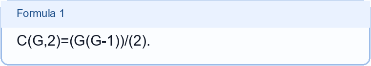


当 `G=100` 时，双敲组合已经达到 4950 个。真实实验通常不可能全部完成。因此虚拟敲除希望回答：

1. 如果敲除某个基因，细胞状态会往哪个方向变化？
2. 哪些 pathway、protein、TF activity 或 ATAC regulatory features 会发生强响应？
3. 多基因组合是否可能产生非加和效应？
4. 是否能在普通单细胞数据上应用已有 reference perturbation model？

在药物靶点筛选、免疫调控、肿瘤耐药、细胞命运转换和组合 perturbation 设计中，这类问题都很关键。

---

## 2. 主流虚拟敲除方法与本方法定位

### 2.1 主流方法

| 方法类别 | 代表思想 | 优点 | 局限 |
|---|---|---|---|
| Linear / additive baseline | 用单基因 KO delta 相加预测组合 KO | 简单、稳健、小样本友好 | 难处理非线性交互 |
| Latent embedding / autoencoder | 在低维潜空间建模 perturbation effect | 能压缩复杂表达状态 | 小样本下可能不稳定，解释性较弱 |
| conditional VAE | 条件生成 KO 后细胞状态 | 可生成 cell-level 分布 | 需要较多训练数据 |
| flow matching / diffusion | 学习从 control 到 perturbation 的条件生成轨迹 | 分布建模能力强 | 算力和样本需求高 |
| graph / pathway prior model | 用生物网络约束扰动方向 | 可解释，小样本更稳 | 受先验覆盖质量影响 |

### 2.2 我们为什么选择 hard-constrained residual/PLS

本项目面向的是 **小样本多模态数据**。在这种场景下，从零训练复杂生成模型容易出现两个问题：

- 样本量不足，模型可能学到 batch 或噪声；
- 生成结果难解释，用户不知道 KO 影响了哪些 pathway/protein/peak。

因此当前方法采用：


核心原则是：

```text
先把 KO 方向用系统先验约束住；
再生成 control cell 附近、方向合理的 virtual KO cell；
生成模型只学习“方向附近的不确定性和分布形状”，不自由乱跑。
```

---

## 3. 用户输入和软件输出

### 3.1 推荐输入

普通用户不需要自己准备 pathway score。推荐输入是常见单细胞或多组学矩阵：

```text
adata.X                  cells x genes RNA matrix
adata.var_names          gene symbols
adata.obs["ko_target"]   每个细胞的 KO / perturbation 标签
adata.obsm["protein"]    可选，ADT / CITE-seq protein
adata.obsm["atac"]       可选，ATAC gene activity / regulatory score
adata.obsm["chromvar"]   可选，motif activity
adata.obsm["peak"]       可选，peak-level ATAC features
```

10X 数据可以先导入：

```powershell
.\.venv\Scripts\python.exe -m vkx.cli import-data `
  --input path\to\filtered_feature_bc_matrix `
  --format 10x_mtx `
  --metadata-csv metadata.csv `
  --cell-id-col cell_id `
  --out-dir results\import_10x_ko
```

有 KO 标签的 10X metadata 例子：

```csv
cell_id,ko_target,cell_type,batch
AAACCCAAGAAACACT-1,control,T_cell,batch1
AAACCCAAGAAACCAT-1,STAT1,T_cell,batch1
AAACCCAAGAAAGTGG-1,JAK2,Mono,batch2
AAACCCAAGAAATCCA-1,STAT1+JAK2,Mono,batch2
```

### 3.2 输出

每次 benchmark 运行固定输出：

| 文件 | 含义 |
|---|---|
| `derived_state_scores.csv` | 软件从原始矩阵自动派生出的 state score |
| `derived_state_manifest.csv` | 每个 state feature 的来源 |
| `summary.csv` | 总体效果指标 |
| `metrics.csv` | 每个 KO、每个 feature 的分布距离 |
| `delta_table.csv` | 真实 KO delta 与虚拟 KO delta |
| `virtual_cells.csv` | 生成的虚拟 KO 单细胞状态 |
| `auc_summary.csv` | 强响应识别 ROC-AUC |
| `report.md` | 自动解释报告 |

默认图：

| 图 | 作用 |
|---|---|
| `01_summary_dashboard.png` | 一页总览 |
| `02_true_vs_virtual_heatmap.png` | 真实 KO vs 虚拟 KO 变化 |
| `03_cell_state_umap.png` | control、virtual KO、true KO 的单细胞状态移动 |
| `04_auc_strong_response_roc.png` | 强响应 feature 排序能力 |
| `05_atac_peak_level_changes.png` | 如果有 peak 特征，展示 peak-level 变化 |

---

## 4. 模型算法与数学公式

### 4.1 数据定义

设有 `N` 个细胞，原始 RNA 表达矩阵为：


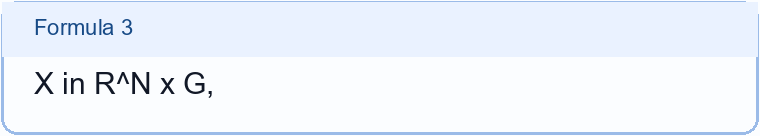


其中 `G` 是基因数。每个细胞有 perturbation 标签：


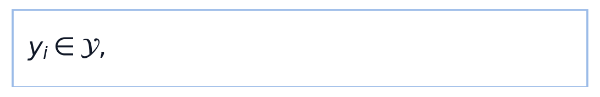


其中 control 细胞集合记为：


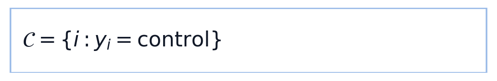


若有 protein、ATAC、chromVAR 或 peak-level features，分别记为：


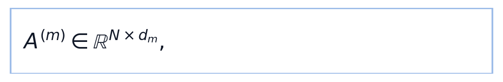


其中 `m` 表示模态。

### 4.2 RNA 到 pathway/program score

给定 pathway / gene set `P_k subset \1,...,G\`，第 `i` 个细胞的 pathway score 可写成：


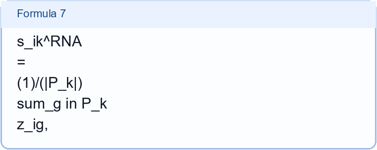


其中 `z_ig` 是标准化后的 gene expression。实际实现中会筛选与当前数据 gene symbols 有交集的 Reactome、MSigDB、TF-target、PPI 等 gene set。

多模态 state vector 定义为：


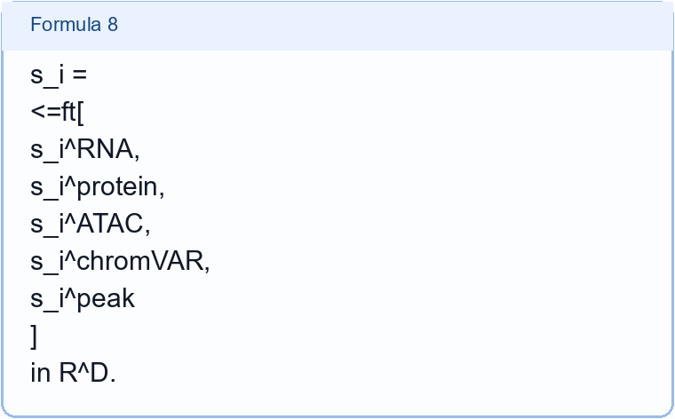


所有细胞组成 state matrix：


### 4.3 真实 KO delta

control 平均状态为：


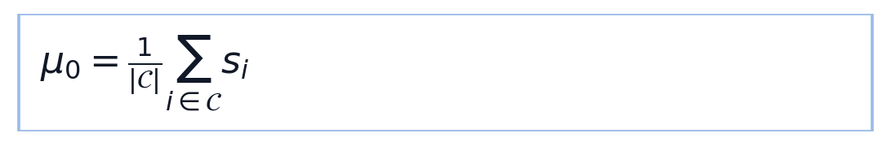


对某个 KO 标签 `y`，真实 KO 平均状态为：


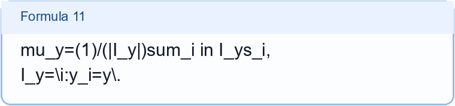


真实 KO effect / delta 定义为：


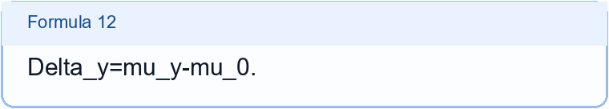


### 4.4 KO 基因的系统先验向量

对 KO 标签 `y`，解析出被敲除的基因集合：


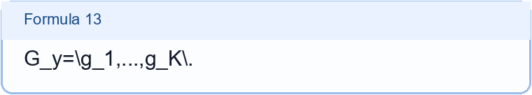


给定先验库中的 term `T_l`，例如 Reactome pathway、TF target set 或 PPI neighborhood，构造 overlap feature：


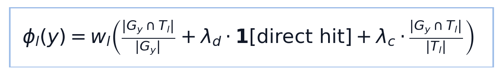


其中：

- `w_l` 是 library / mechanism 权重；
- direct hit 表示 term 名称或 TF/motif 与 KO gene 直接相关；
- `lambda_d,lambda_c` 是直接命中和覆盖率权重。

所有 term 组成 KO prior vector：


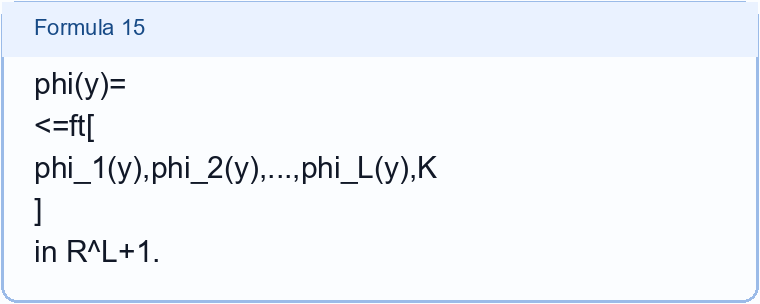


这里额外加入 `K=|G_y|`，用于区分单敲和多敲。

### 4.5 PLS / residual KO delta 预测

训练集包含若干已知 KO：


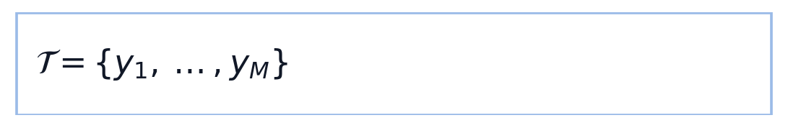


构造训练矩阵：


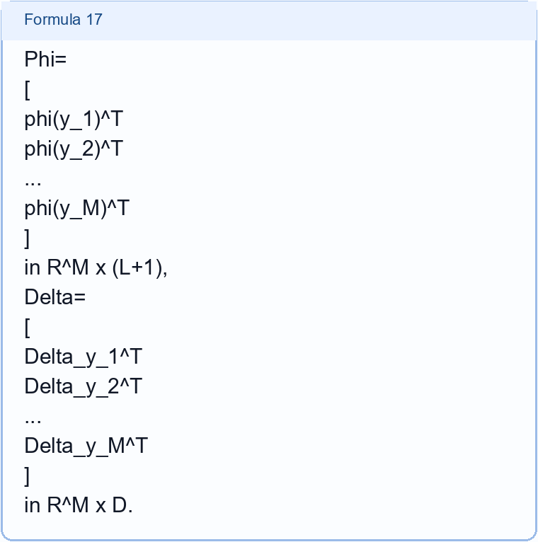


PLS 回归学习：


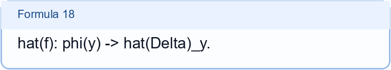


预测为：


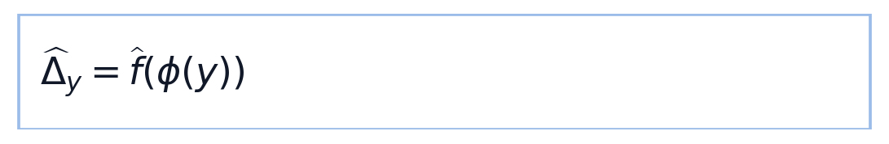


为改善幅度，可用留一训练预测做 calibration。若 `hat(Delta)^LOO` 是 leave-one-out 预测，真实值为 `Delta`，全局缩放可写为：


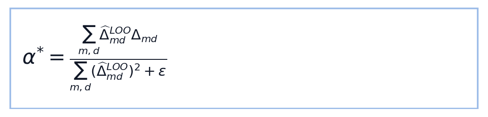


最终：


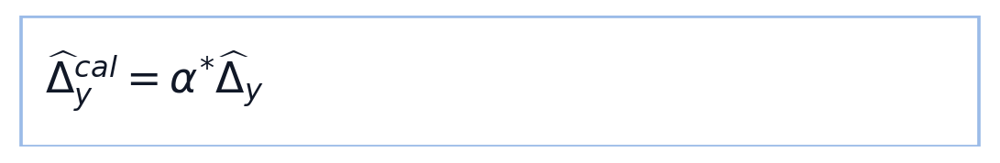


也可以按 feature 估计 `alpha_d`。

### 4.6 单细胞 virtual KO 生成

最基础的 hard-constrained cell-level 生成是：


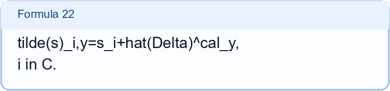


为了避免保留过强的 control 均值偏移，当前实现使用：


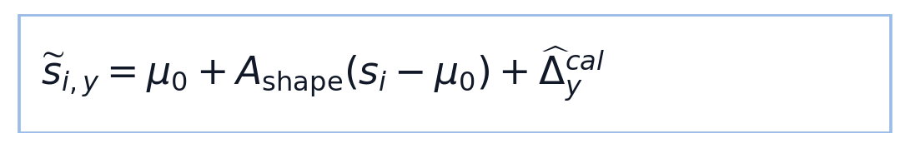


其中 `A_shape` 是对角 shape calibration 矩阵。

#### Variance shape calibration

对训练 KO 学习每个 feature 的方差比：


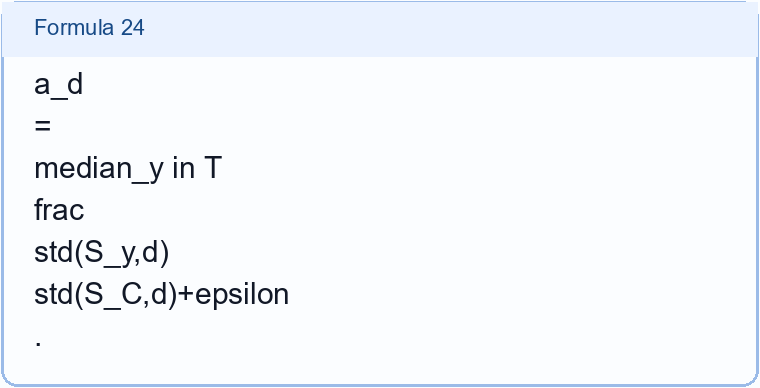


于是：


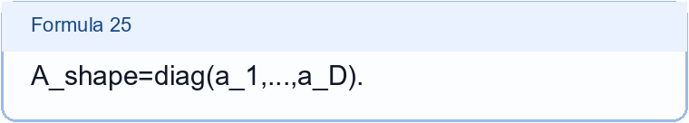


#### Quantile / zero-inflated shape calibration

对每个 feature `d`，在训练 KO 中学习 centered quantile：


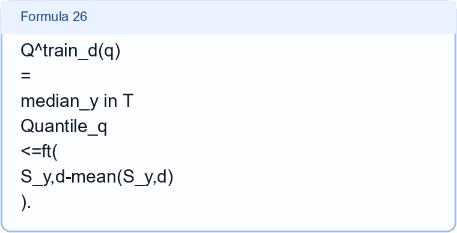


对 control cell `s_i,d` 计算其在 control 样本中的经验分位数：


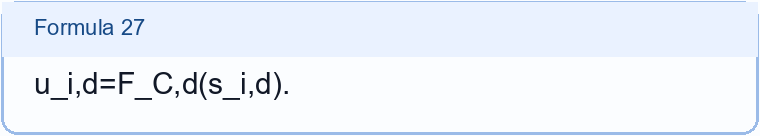


生成 shaped residual：


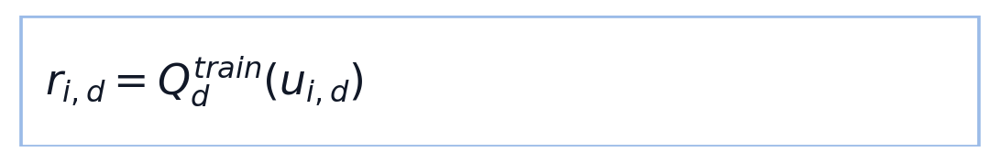


最终：


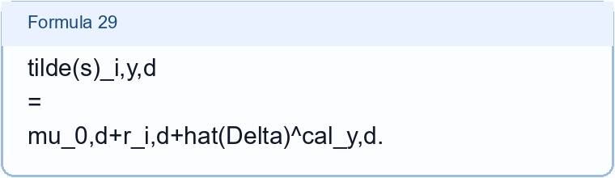


对原始非负 sparse peak/count，还记录开放比例：


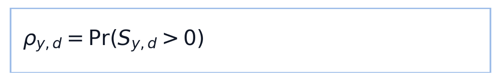


如果输入是原始非负 peak/count，可以对 open/closed cells 做 hard constraint。  
如果输入已经是中心化 peak state score，则只记录 `rho`，不强行置零。我们实测发现，对中心化 peak score 强行 hard-zero 会显著破坏 Wasserstein distribution improvement。

### 4.7 双基因 interaction residual

对双敲 `y=a+b`，最简单 additive baseline 是：


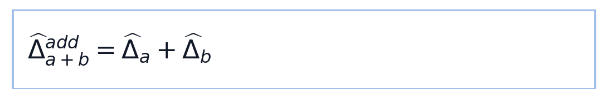


但真实双敲常有非加和效应：


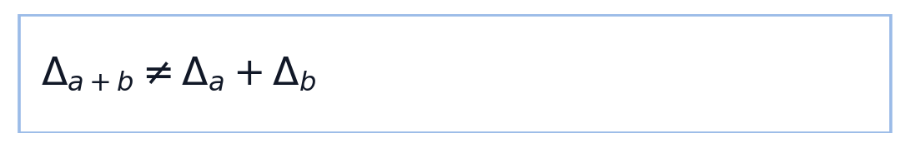


因此引入 interaction residual：


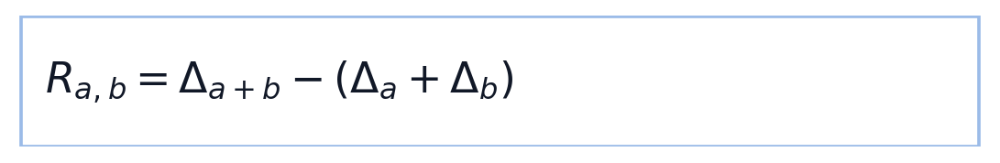


构造基因对先验：


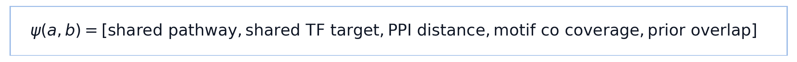


学习：


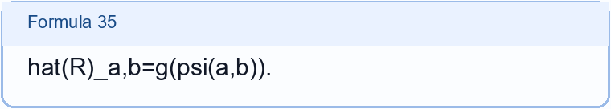


最终双敲预测：


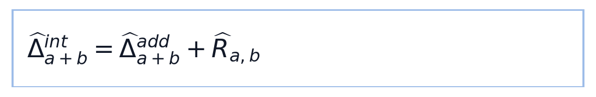


在 Norman 和 HMPCITE 双敲实验中，interaction residual 明显改善连续幅度预测。

---

## 5. 评估指标

### 5.1 Direction cosine

衡量预测方向是否与真实 KO 方向一致：


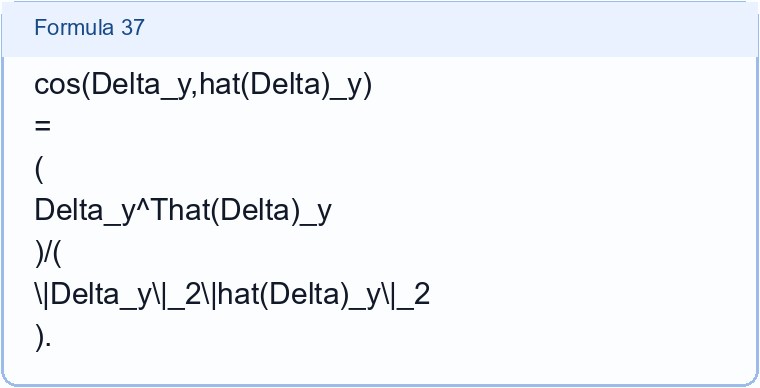


越接近 1 越好。

### 5.2 MAE

衡量变化幅度误差：


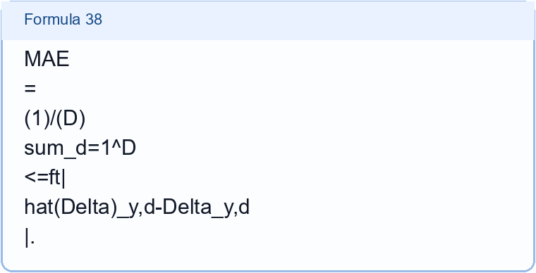


越低越好。

### 5.3 Distribution improvement

对每个 feature 用 Wasserstein distance 比较：


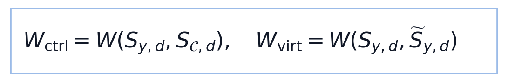


定义：


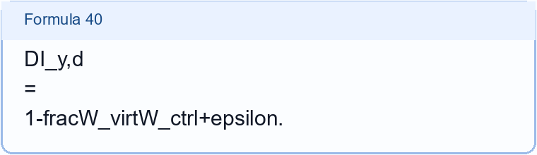


若 `DI>0`，说明虚拟 KO 比 control 更接近真实 KO。  
`improved fraction` 是 `DI>0` 的 feature 比例。

### 5.4 ROC-AUC

将真实强响应 feature 定义为：


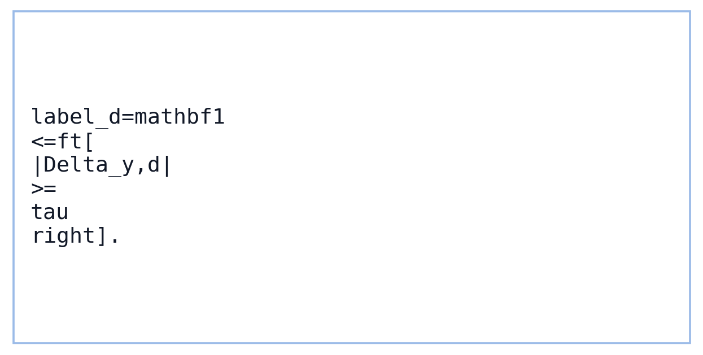


预测分数为：


ROC-AUC 衡量模型能否把真实强响应 feature 排到前面。注意：当 feature 很少时，例如只有 5 个 program，AUC 可能为 1，但解释必须谨慎。

---

## 6. 方法总览图

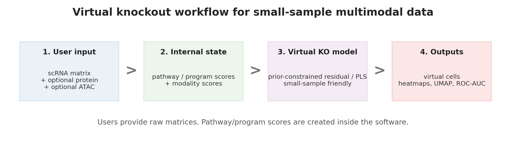

这张图概括了当前软件工作流：用户输入原始矩阵和 KO 标签，软件内部转换成 pathway/protein/ATAC 状态表示，再用系统先验和 residual/PLS 预测 KO delta，最后输出 virtual cells、heatmap、UMAP、AUC 曲线和解释报告。

---

## 7. 最新结果总表

| run | n_ko | n_features | distribution improvement | improved fraction | direction cosine | MAE | AUC | shape |
|---|---:|---:|---:|---:|---:|---:|---:|---|
| RNA+ADT Papalexi raw h5ad | 4 | 28 | 0.1112 | 0.7589 | 0.6793 | 0.3171 | 0.8015 | none |
| Single-gene demo | 1 | 28 | 0.1439 | 0.8214 | 0.8787 | 0.4244 | 0.8778 | none |
| Double-gene demo | 1 | 5 | 0.2409 | 0.6000 | 0.9595 | 0.1269 | 1.0000 | none |
| HMPCITE multimodal double-KO | 1 | 32 | 0.5475 | 0.8750 | 0.9759 | 0.1139 | 0.9784 | none |
| ATAC gene activity | 1 | 30 | -0.0002 | 0.4667 | 0.5125 | 0.0532 | 0.6411 | none |
| ATAC gene activity + chromVAR | 1 | 2204 | 0.0187 | 0.5944 | 0.4324 | 0.0582 | 0.5524 | none |
| ATAC top100 chromVAR | 1 | 130 | 0.0428 | 0.6154 | 0.6175 | 0.0505 | 0.5859 | none |
| ATAC regulatory peaks | 1 | 240 | -0.1762 | 0.3750 | 0.7710 | 0.0612 | 0.6738 | none |
| ATAC regulatory peaks + variance | 1 | 240 | -0.0594 | 0.5125 | 0.7710 | 0.0612 | 0.6738 | variance |
| ATAC regulatory peaks + quantile | 1 | 240 | 0.1664 | 0.7875 | 0.7710 | 0.0612 | 0.6738 | quantile |

主要解释：

- Papalexi RNA+ADT 结果说明，多模态 pathway/protein score 可用于稳定单敲评估。
- HMPCITE 结果说明，真实 RNA+ADT+GDO double-KO 数据也能支持多模态双敲 benchmark。
- ATAC 结果说明，简单 gene activity 不够；引入 chromVAR、regulatory peaks、weighted prior 和 shape calibration 后，单细胞 peak distribution 明显改善。

---

## 8. 单基因 KO 结果

### 8.1 Papalexi STAT1 单敲

输出目录：

```text
results/software_interface_single_gene_demo
```

主要结果：

| 指标 | 值 |
|---|---:|
| n_ko | 1 |
| n_features | 28 |
| mean distribution improvement | 0.144 |
| improved fraction | 0.821 |
| direction cosine | 0.879 |
| MAE | 0.424 |
| ROC-AUC | 0.878 |

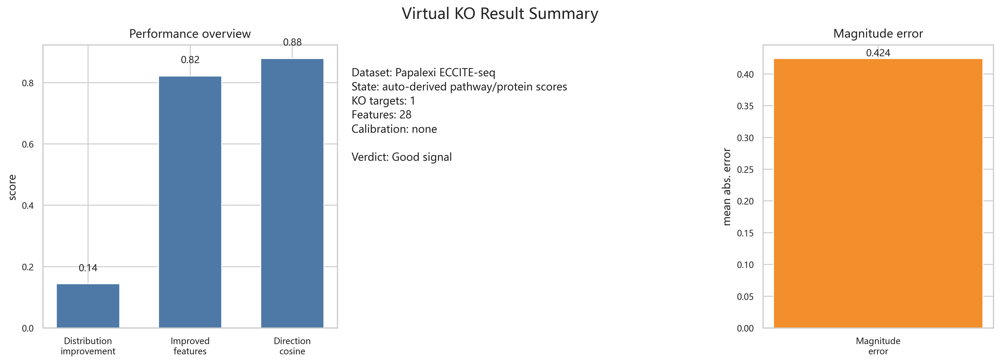

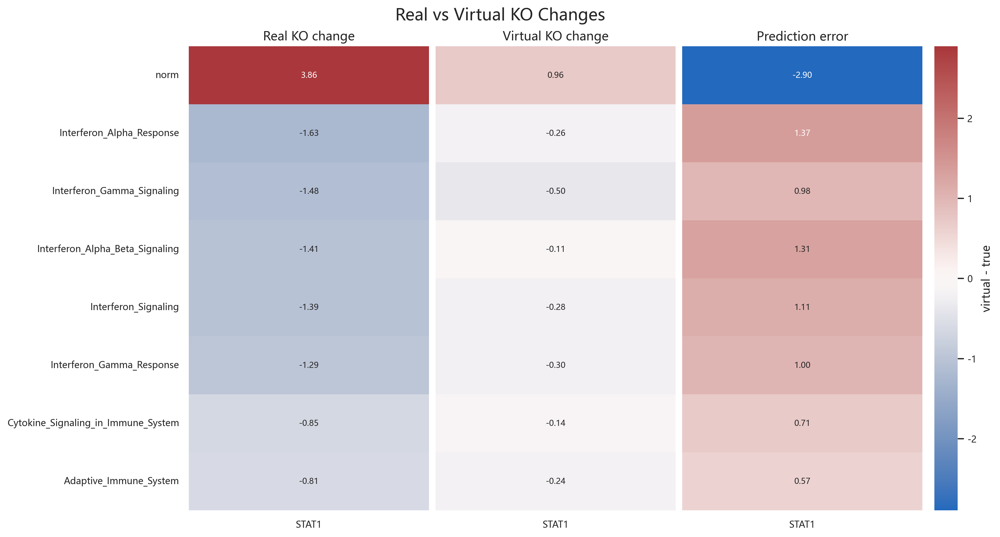

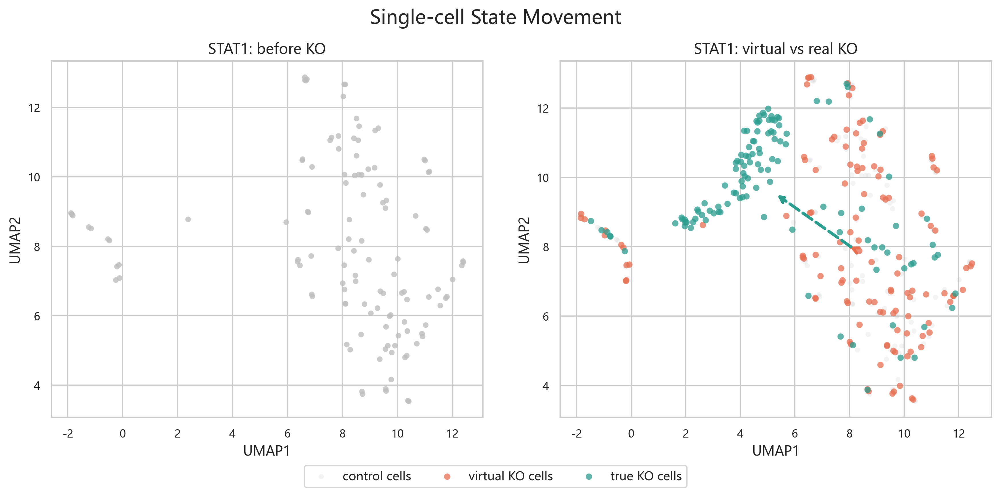

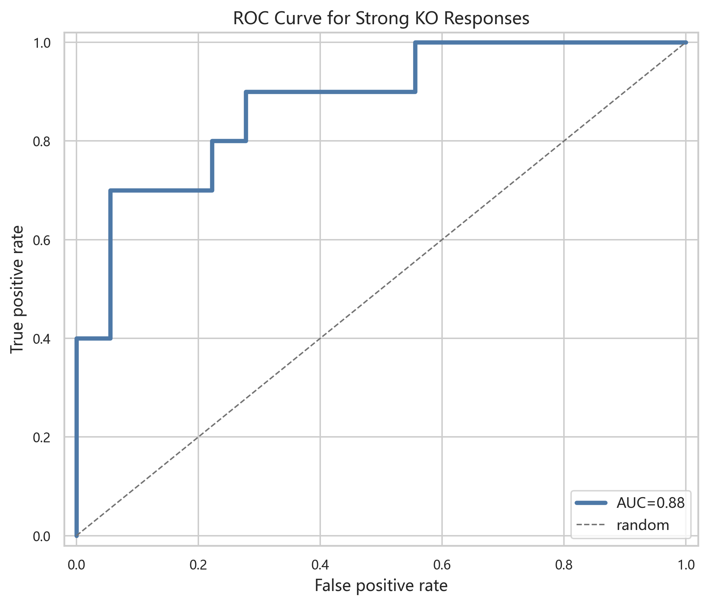

解释：

- direction cosine 高，说明整体 KO 方向预测较好；
- improved fraction 达到 82.1%，说明大部分 pathway/protein feature 在虚拟 KO 后比 control 更接近真实 KO；
- MAE 仍然不低，说明强变化幅度仍有低估或过估。

---

## 9. 双基因 KO 结果

### 9.1 Norman CEBPB+CEBPA 双敲示例

输出目录：

```text
results/software_interface_double_gene_demo
```

主要结果：

| 指标 | 值 |
|---|---:|
| n_ko | 1 |
| n_features | 5 |
| mean distribution improvement | 0.241 |
| improved fraction | 0.600 |
| direction cosine | 0.960 |
| MAE | 0.127 |
| ROC-AUC | 1.000 |

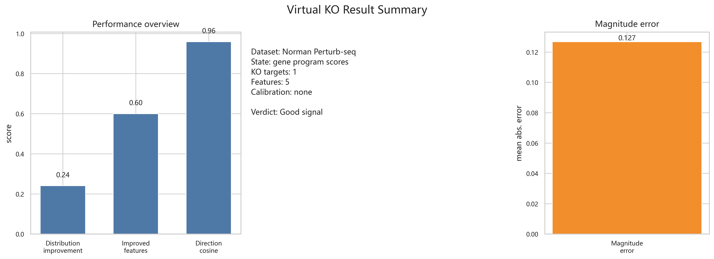

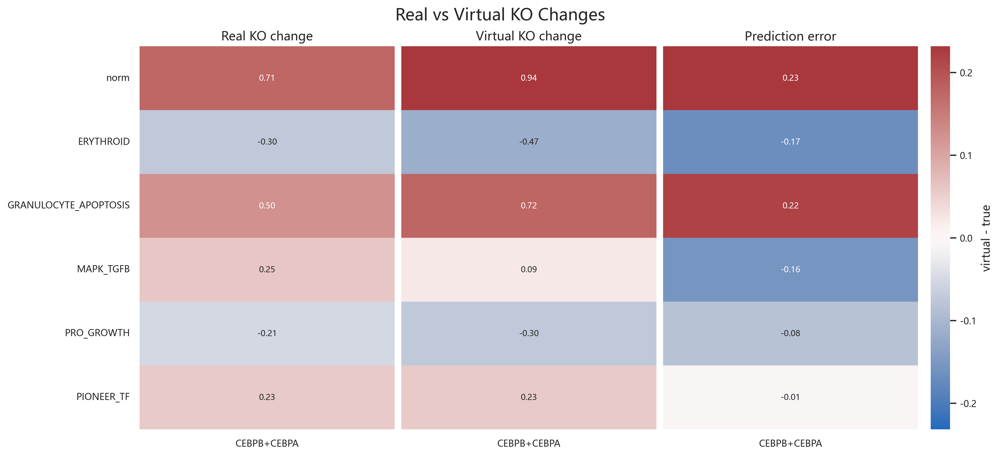

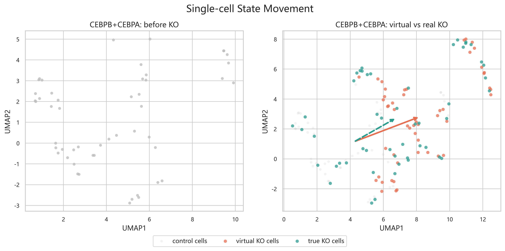

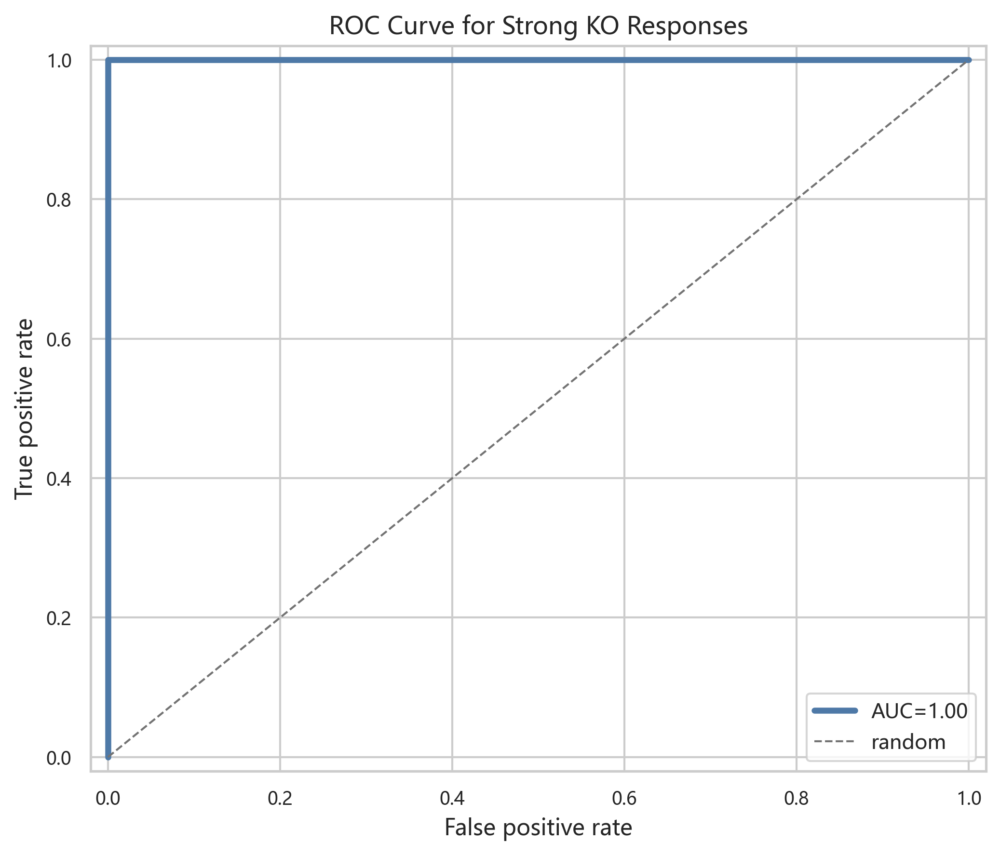

注意：这里 ROC-AUC = 1.000，因为只有 5 个 gene program，说明强响应排序在该例子中完全正确，但不能过度泛化。

### 9.2 Norman 52 个双敲组合 interaction residual

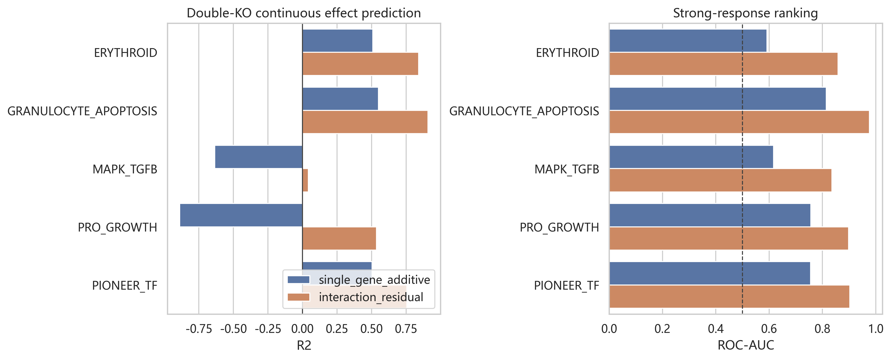

| model | subset | mean MAE | mean R2 | mean ROC-AUC | mean PR-AUC |
|---|---|---:|---:|---:|---:|
| single_gene_additive | all_combos | 0.150 | 0.008 | 0.707 | 0.682 |
| interaction_residual | all_combos | 0.076 | 0.617 | 0.894 | 0.845 |
| single_gene_additive | has_unseen_gene | 0.159 | -0.101 | 0.638 | 0.586 |
| interaction_residual | has_unseen_gene | 0.067 | 0.697 | 0.895 | 0.862 |

解释：

- interaction residual 明显改善双敲连续幅度预测；
- 对 has_unseen_gene 子集提升更明显，说明系统先验交互项有助于外推；
- MAPK/TGFB 和 Pro-growth 这类原本困难的 program 得到明显修正，但仍需要更强非线性建模。

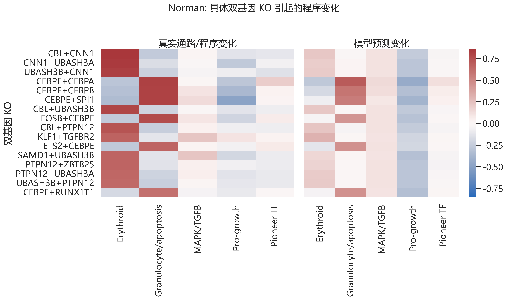

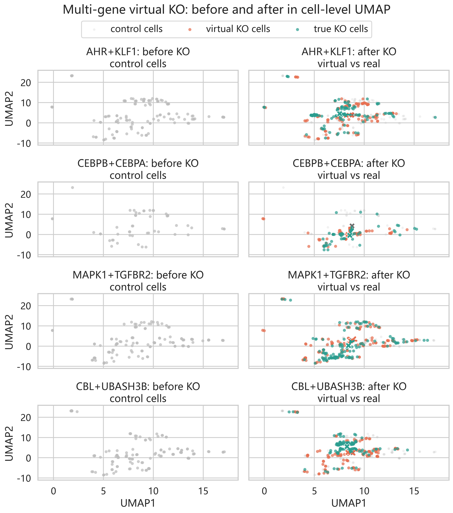

---

## 10. 真实多模态 double-KO：HMPCITE-seq

接入数据：GSE243244 HMPCITE-seq perturbation sample。

数据包含：

```text
19,714 cells
32,286 RNA genes
2 ADT proteins
11 single-gene perturbations
55 real double-gene perturbation combinations
```

### 10.1 Cebpb+Med12 多模态双敲

输出目录：

```text
results/hmpcite_multimodal_doubleko_cebp_med12
```

结果：

| 指标 | 值 |
|---|---:|
| mean distribution improvement | 0.548 |
| improved features | 87.5% |
| direction cosine | 0.976 |
| MAE | 0.114 |
| ROC-AUC | 0.978 |

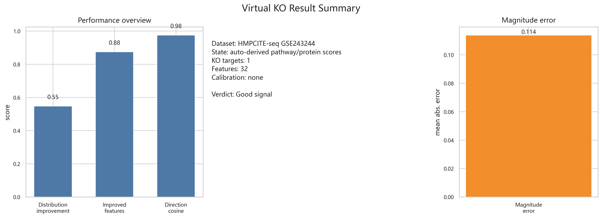

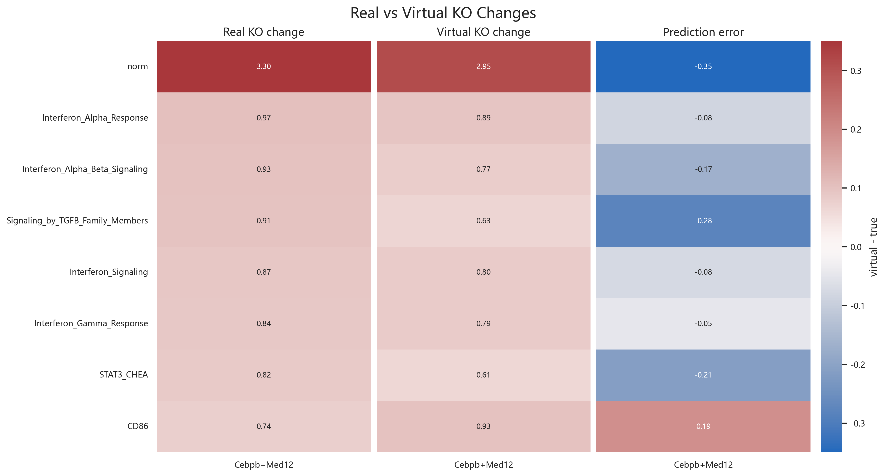

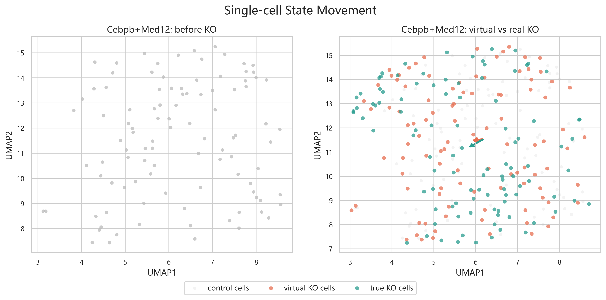

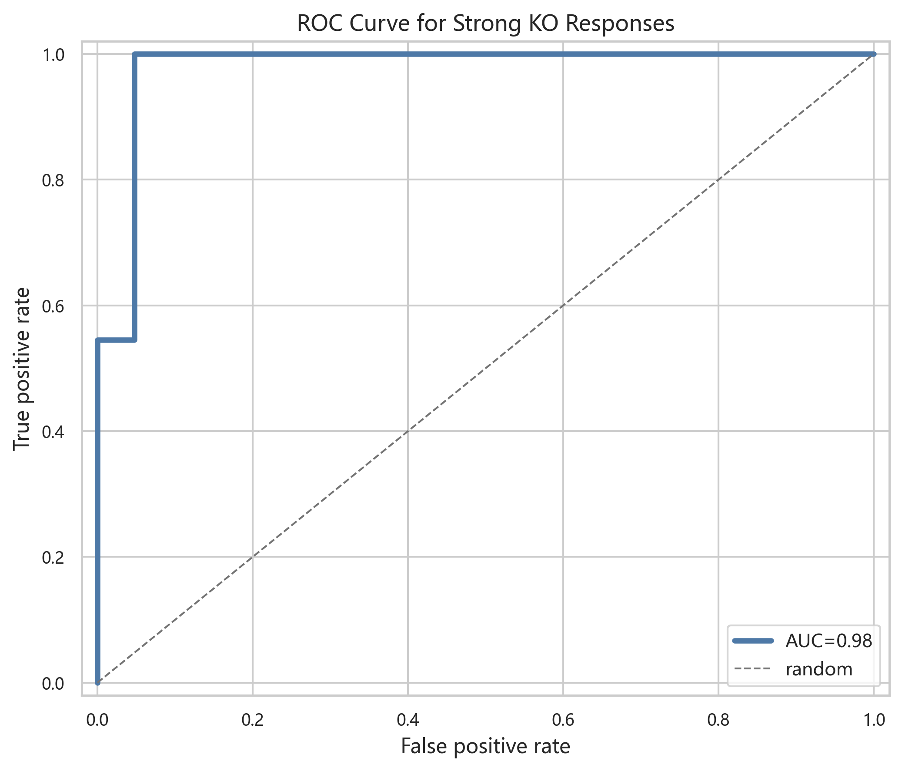

### 10.2 55 个真实多模态双敲 interaction residual

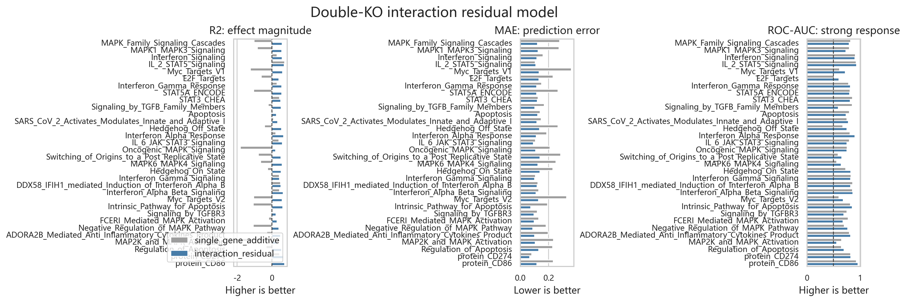

总体结果：

| model | MAE | R2 | ROC-AUC |
|---|---:|---:|---:|
| single_gene_additive | 0.195 | -0.334 | 0.763 |
| interaction_residual | 0.113 | 0.507 | 0.768 |

解释：

- interaction residual 明显降低 MAE；
- R2 从负值转正，说明连续变化幅度预测得到实质改善；
- AUC 变化不大，说明这里主要提升的是数值幅度，而不是强响应排序。

---

## 11. ATAC / chromVAR / peak-level regulatory prior

### 11.1 为什么 ATAC peak 更难？

ATAC peak 通常是 zero-inflated sparse distribution。很多 peak 在大多数细胞中关闭，只在少数细胞中开放。因此仅预测平均 delta 不够，还要处理：

- open fraction；
- 分位数形状；
- 稀疏分布尾部；
- peak 与 target gene locus、TF/motif、marker peak、KO effect 的关系。

### 11.2 KDM6A ATAC benchmark

最新用户总览图：

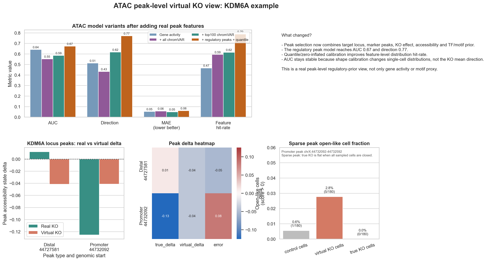

ATAC 结果对比：

| 模型 | AUC | direction | MAE | feature hit-rate |
|---|---:|---:|---:|---:|
| Gene activity | 0.641 | 0.513 | 0.053 | 0.467 |
| all chromVAR | 0.552 | 0.432 | 0.058 | 0.594 |
| top100 chromVAR | 0.586 | 0.618 | 0.051 | 0.615 |
| regulatory peaks + quantile | 0.674 | 0.771 | 0.061 | 0.788 |

进一步看 shape calibration：

| 版本 | distribution improvement | improved fraction | direction | AUC |
|---|---:|---:|---:|---:|
| regulatory peak prior | -0.176 | 0.375 | 0.771 | 0.674 |
| regulatory peak prior + variance shape | -0.059 | 0.513 | 0.771 | 0.674 |
| regulatory peak prior + quantile shape | 0.166 | 0.788 | 0.771 | 0.674 |

解释：

- regulatory peak prior 改善了方向和强响应排序；
- variance shape calibration 改善了分布距离，但平均仍未转正；
- quantile shape calibration 将 distribution improvement 提到正值，说明虚拟 KO peak distribution 比 control 更接近真实 KO；
- AUC 不变是合理的，因为 shape calibration 改善单细胞分布形状，而不是改变 KO 平均方向排序。

### 11.3 关于 sparse peak 图的解释

右下角图现在显示 `open-like cell fraction`。例如 KDM6A promoter peak：

```text
control cells: 1/180 open-like
virtual KO cells: 5/180 open-like
true KO cells: 0/180 open-like
```

原先 violin plot 中 true KO 像一条线，是因为所有 true KO 采样细胞都在 closed baseline；这不是画图错误，而是 ATAC sparse peak 的真实稀疏形状。新版图直接显示开放比例，避免误读。

---

## 12. Reference model 与普通 10X 应用

普通 10X 没有 KO 标签时，软件可以做：


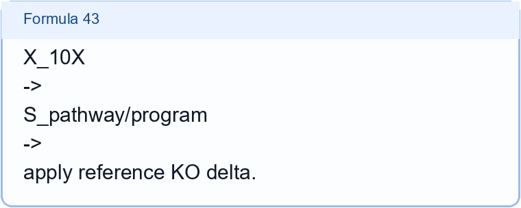


但不能在该数据内部计算真实准确率，因为没有真实 KO 对照。

Reference workflow：

```powershell
.\.venv\Scripts\python.exe -m vkx.cli train-reference `
  --input-h5ad data\papalexi_small_pathway.h5ad `
  --ko-col ko_target `
  --prior-dir data\priors `
  --output-model results\reference_models\papalexi_rna_protein_reference.pkl
```

应用：

```powershell
.\.venv\Scripts\python.exe -m vkx.cli apply-reference `
  --reference-model results\reference_models\papalexi_rna_protein_reference.pkl `
  --input-h5ad your_10x_data.h5ad `
  --target-kos STAT1,JAK2,STAT1+JAK2 `
  --cell-type-col cell_type `
  --out-dir results\your_10x_virtual_ko_batch
```

示例图：

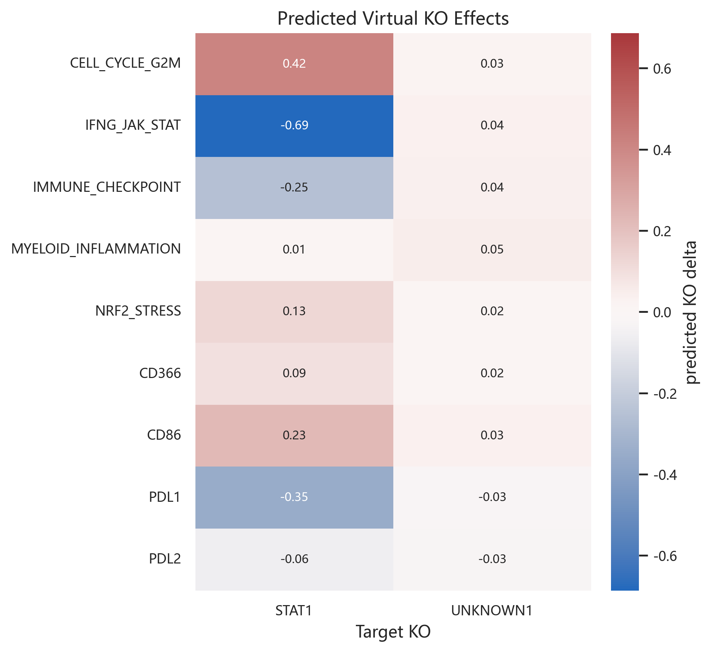

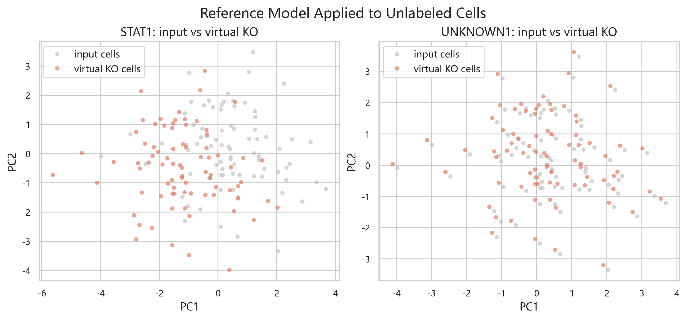

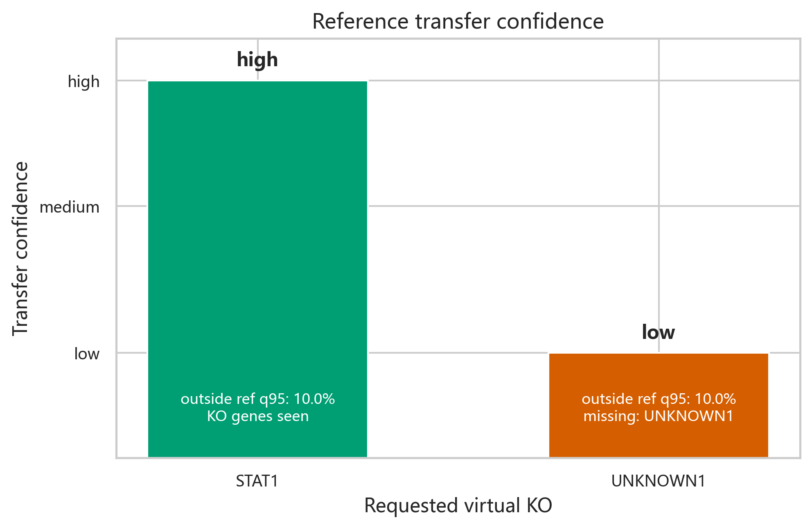

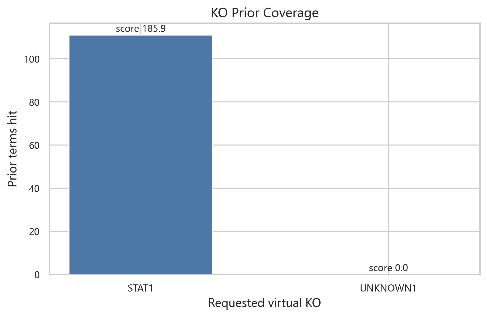

---

## 13. 适用性、优点与限制

### 13.1 适用场景

当前方法适合：

- 小样本 perturb-seq / CRISPR screen；
- RNA + ADT / RNA + ATAC / RNA + ADT + ATAC 多模态数据；
- 单基因 KO 的方向预测；
- 双基因 KO 的初步筛选和 interaction residual 修正；
- pathway/protein/regulatory feature 层面的机制解释；
- 普通 10X 数据上的 prediction-only virtual KO application。

### 13.2 优点

1. **小样本友好**：不依赖大规模预训练。
2. **多模态可扩展**：RNA、protein、ATAC、chromVAR、peak 均可作为 state feature。
3. **结果可解释**：输出 pathway/protein/TF/peak 层面的变化。
4. **先验驱动**：Reactome/MSigDB/TF-target/PPI/motif prior 可支持 unseen gene 外推。
5. **图形清楚**：heatmap、UMAP、ROC、summary dashboard、peak-level plot 都已自动输出。

### 13.3 限制

1. **不是自由 diffusion/VAE 生成模型**：当前是 hard-constrained residual/PLS，更稳但表达能力有限。
2. **unseen gene 依赖先验覆盖**：如果目标基因缺少 pathway/TF/PPI/motif 信息，置信度应降低。
3. **复杂非线性组合仍困难**：MAPK/TGFB 等 program 虽有改善，但仍是难点。
4. **AUC 在少特征场景要谨慎**：例如 5 个 gene program 时 AUC=1 不代表大规模泛化完美。
5. **普通 10X 无真实 KO 标签不能评估准确率**：只能做 prediction-only。
6. **ATAC peak 输入类型需区分**：原始非负 peak/count 和中心化 peak state score 不能用同一种 hard-zero 解释。

---

## 14. 结论

目前的模型已经形成一个可复用软件接口，并在多个数据场景中跑通：

- RNA+ADT 单敲；
- RNA-derived program 双敲；
- RNA+ADT+GDO 真实多模态双敲；
- ATAC gene activity + chromVAR + peak-level regulatory prior；
- 普通 10X / reference prediction-only workflow。

从结果看，**小样本多模态虚拟敲除思路是成立的**。关键不是“最新算法足够强所以样本可以很少”，而是：


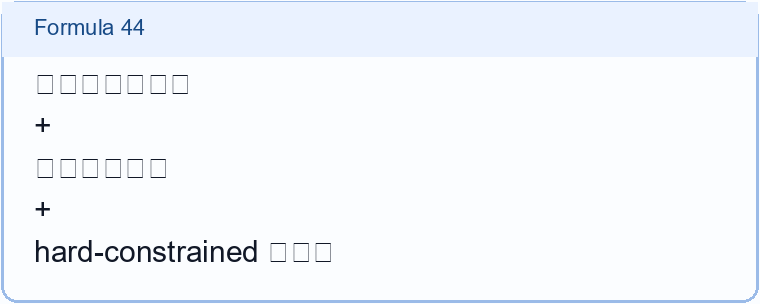


共同降低了学习难度。

最推荐的当前定位是：

```text
机制先验驱动的小样本多模态虚拟敲除框架，
用于 KO 强响应筛选、pathway/protein/regulatory state 预测、
双基因组合初筛和普通 10X prediction-only 应用。
```

下一步应继续：

1. 将 interaction residual 深度集成进主 CLI 和 reference model；
2. 加入 batch covariate 显式建模；
3. 接入真正 RNA+ADT+ATAC 且带 perturbation 标签的公开 benchmark；
4. 在当前稳定 baseline 上接轻量 conditional VAE / flow matching / diffusion，只学习 hard constraint 附近的不确定性范围；
5. 继续增强 ATAC peak-gene linkage、motif-to-peak annotation 和 raw peak count 支持。

---

## 15. 关键文件索引

### 软件接口

```text
README.md
docs/software_interface.md
vkx/cli.py
vkx/core.py
vkx/preprocess.py
vkx/visualization.py
vkx/reference.py
vkx/interaction.py
```

### 主要报告

```text
docs/single_double_knockout_results.md
docs/hmpcite_multimodal_doubleko_integration.md
docs/atac_peak_regulatory_prior_v2.md
docs/ordered_enhancement_plan.md
```

### 最新核心图

```text
results/user_facing_figures/01_method_workflow.png
results/user_facing_figures/08_auc_roc_curves.png
results/user_facing_figures/09_multimodal_multi_dataset_summary.png
results/user_facing_figures/14_hmpcite_multimodal_doubleko_summary.png
results/user_facing_figures/19_atac_peak_level_visualization.png
results/figures/norman_double_interaction_model_comparison.png
```

